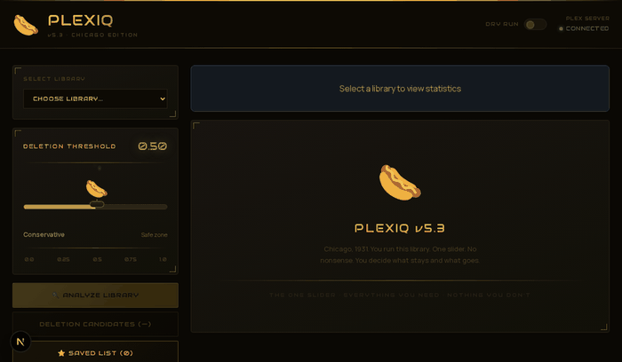

# PlexIQ v5.3.1 — The Chicago Edition 🌭

<p align="center">
  
</p>


---

**Smart Plex Media Library Management. One slider. No nonsense. Just HOTDOGS.**

PlexIQ analyzes your Plex library using multi-factor scoring (play count, ratings, file size) and surfaces deletion candidates through a cinematic 1930s Chicago noir interface. Built with *The Untouchables* — but even some of them had to die.

> **# We are NOT responsible for your data loss. #**
>
> You will be asked **three** times before anything gets deleted. The third time, you'll enter your deletion password. After that — it's gone. `OUR SOFTWARE WILL NOT BACK UP YOUR DATA EVER.` We love you. Be careful out there. ☠️

---

## GET YOUR REDHOTS! 🌭🌭🌭
### &nbsp;&nbsp;&nbsp;&nbsp;&nbsp;&nbsp;&nbsp;&nbsp;&nbsp;&nbsp;&nbsp;&nbsp;&nbsp;&nbsp;&nbsp;&nbsp;&nbsp;&nbsp;&nbsp;&nbsp;&nbsp;&nbsp;&nbsp;&nbsp;GET YOUR REDHOTS OVER HERE! 📣

---

## ✨ What It Does

### Core Capabilities

- 📊 **Intelligent Scoring** — Multi-factor algorithm weighing play count, IMDb/TMDb/Rotten Tomatoes ratings, and file size. Run a fresh Plex library scan before deleting to ensure the freshest weights.
- 🌭 **The Hotdog Slider** — That one UI element is the **smartest** knob you have. Drag it. You'll understand immediately.
- ★ **The Untouchables** — Star any title to permanently protect it from the Cut List. Marquee lights included. No extra charge.
- 🛡️ **Dry Run by Default** — Nothing gets touched until you flip the switch. Ratings ≥ 8.0 are always protected, no exceptions.
- 🗑️ **THE CUT LIST** — Your deletion candidates, ranked by score. Multi-select, page through, or nuke the whole list. Your call.
- 📋 **Full Audit Trail** — Every action logged. What went where and when.

### UI/UX Principles

1. **Hotdog Grabbing** — The slider IS the interface. Pull it left, things get safer. Pull it right, things get spicy.
2. **The Untouchables** — Star it. Save it. Mean it.
3. **Three Strikes** — Three confirmation steps + password before live deletion. We really don't want you to be sad.
4. **Clarity & Feedback** — Progress bars, status dots, live Plex connection indicator.
5. **Aesthetic & Delight** — 1930s Chicago noir. Art deco gold. Police sirens when it gets real.

---

## 🚀 Quick Start

### Prerequisites

- Node.js 18+
- A running Plex Media Server
- Your Plex API token ([how to find it](https://support.plex.tv/articles/204059436-finding-an-authentication-token-x-plex-token/))

### Install

```bash
git clone https://github.com/richknowles/PlexIQ.git
cd PlexIQ/web
npm install
```

### Configure

Create a `.env.local` file in the `web/` directory:

```bash
PLEX_HOST=http://YOUR_PLEX_IP:32400
PLEX_TOKEN=your_plex_token_here
```

> **PRO TIP:** See Step 1. Run the app. Grab a hotdog. We'll handle the rest.

### Run

```bash
# Development (hot reload via Turbopack)
npm run dev

# Production build
npm run build
npm start
```

Open [http://localhost:3000](http://localhost:3000) — or wherever you're hosting it.

---

## 🎛️ How To Use It

1. **Select a library** from the dropdown (Movies, TV, whatever you've got)
2. **Drag the hotdog** to set your aggression level — left is conservative, right is scorched earth
3. **Click Analyze Library** — PlexIQ scores every item against your Plex data in real time
4. **Review THE CUT LIST** — high scores = good deletion candidates. Check the scores. Trust the algorithm. Or don't. It's your data.
5. **Star anything sacred** → it moves to THE UNTOUCHABLES and is never touched
6. **Flip to Live Mode** if you're sure. Three confirmations. Password. Then it's done.

---

## 🧮 Scoring System

Scores range from `0.0` (keep it forever) to `1.0` (why does this exist).

```
Score = 0.55 × (8 - rating) / 8   +   0.45 × e^(−plays × 0.9)
```

- **Ratings factor (55%)** — Low-rated content scores higher for deletion
- **Play count factor (45%)** — Never watched = high score. Rewatched 12 times = untouchable in spirit, even if not starred

**Hard rule:** Anything rated ≥ 8.0 is protected at the UI level regardless of score.

---

## 🌭🌭🌭 Hotdogs are a risky business!

### Dry Run Mode (default)

The toggle is in the header. When it says **DRY RUN**, nothing real happens — you're just previewing. The interface will tell you exactly what *would* get deleted.

### Live Mode

Flip the toggle to **LIVE MODE**. A red warning banner appears. The delete button changes. The police sirens come out.

Three confirmation steps:
1. Review what's being deleted
2. Confirm the count
3. Enter your deletion password

After step 3 — files are gone. `review all recommendations before executing — three strikes and you're out!!! ❌❌❌ 😵`

---

## 📁 Project Structure

```
PlexIQ/
└── web/                        # Next.js 15 app (the whole show)
    ├── app/
    │   ├── page.tsx            # Main dashboard — all the Chicago magic
    │   ├── api/
    │   │   ├── libraries/      # GET /api/libraries → Plex library list
    │   │   ├── analyze/        # GET /api/analyze?sectionId=X → scored movies
    │   │   └── delete/         # POST /api/delete → live deletion endpoint
    │   └── layout.tsx
    ├── components/
    │   ├── threshold-slider.tsx # THE HOTDOG (do not underestimate it)
    │   ├── library-stats.tsx   # Stats display panel
    │   └── mustard-progress.tsx
    ├── types/
    │   └── plexiq.ts
    └── .env.local              # Your Plex credentials (never commit this)
```

---

## ⚠️ Important Notes

PlexIQ **DELETES YOUR MEDIA FILES** via the Plex API. It does NOT touch:
- System files
- Plex database
- Configuration files
- User data

Deleted media is removed through Plex's own deletion mechanism. There is no undo. There is no recovery. There is only the hotdog.

---

## 🤝 Contributing / Licensing

Interested in licensing PlexIQ for commercial use, or want to join the cause?

Contact Rich: **support@itwerks.net**

---

## 📄 License

MIT License — see [LICENSE](LICENSE) for details.

---

## 👤 TEAM HOTDOG! 🌭 💙 🌭

**Rich Knowles**
Developer | Cybersecurity Engineer | Musician

**OZ**
The Great & Beautiful

---

## 📞 Support

- **Email**: support@itwerks.net
- **Issues**: [GitHub Issues](https://github.com/richknowles/PlexIQ/issues)
- **Discussions**: [GitHub Discussions](https://github.com/richknowles/PlexIQ/discussions)

---

☠️ **Remember: Always test with Dry Run first. The hotdog will guide you. 🌭**
